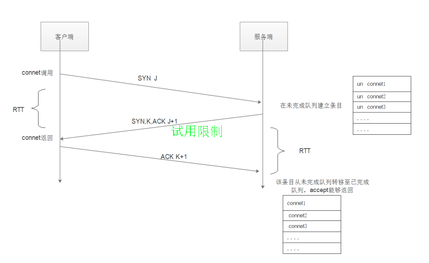

### TCP状态


### TIME_OUT状态

发起挥手的一方才会经历TIME_WAIT状态

**TIME_WAIT状态的影响**
````
具有TIME_WAIT状态的TCP连接，就好像一种残留的信息一样；
当这种状态存在的时候，服务器程序退出并重新执行会失败，会提示错误：
bind函数返回Address already in use
````

**TIME_WAIT状态的影响时间**
````
连接处于TIME_WAIT状态是有时间限制的（1-4分钟之间） = 2 MSL【最长数据包生命周期】；
````

**TIME_WAIT状态的作用**
````
1.实现可靠的实现TCP全双工的终止；
因为服务器端有TIME_WAIT的存在，服务器会重新发送ACK包给客户端，但是如果没有TIME_WAIT这个状态，那么
无论客户端收到ACK包，服务器都已经关闭连接了，此时客户端重新发送FIN，服务器给回的就不是ACK包，
而是RST【连接复位】包，从而使客户端没有完成正常的4次挥手，而且有可能造成数据包丢失；
2.允许老的重复的TCP数据包在网络中消逝；
````

**RST包**
````
close函数发送FIN包会等待发送缓冲区数据发送完毕；
当开启setsockopt(SO_LINGER)，close函数会发送RST包，发送缓冲区数据会被丢弃；
````

### SO_REUSEADDR选项
````
（1）SO_REUSEADDR允许启动一个监听服务器并捆绑其端口，即使以前建立的将端口用作他们的本地端口的连接仍旧存在；
（2）允许同一个端口上启动同一个服务器的多个实例，只要每个实例捆绑一个不同的本地IP地址即可；
（3）SO_REUSEADDR允许单个进程捆绑同一个端口到多个套接字，只要每次捆绑指定不同的本地IP地址即可；
（4）SO_REUSEADDR允许完全重复的绑定：当一个IP地址和端口已经绑定到某个套接字上时，如果传输协议支持；
````

### listen队列
````
调用int listen(int sockfd, int backlog)函数后操作系统会创建2个队列，已完成队列和未完成队列；
未完成队列：当收到客户端发起握手请求SYN数据包时，状态为SYN_RCVD，服务器会在未完成队列创建对应的一项（可以看作一个半连接，至多存留约75秒）；
已完成队列：当第三次握手完成后，连接变成ESTABLISHED状态，从未完成队列移动到已完成队列；
backlog参数含义：指定给定套接字上内核为之排队的最大已完成连接数；
未完成队列大小：内核参数 net.ipv4.tcp_max_syn_backlog；
调用accpet函数时，系统从已完成队列的列头取出来一项返回给调用进程；

假设未完成队列设置为100，  有并发1000个请求过来。假如系统处理过慢。那么系统会做以下几件事
1） 因为未完成队列只有100个。先放100个请求过来处理三次握手。其他的请求直接拒绝。TCP会忽略该分节，也就是不送RST，这样客户端将重发SYN,期望在未完成队列中找到位置；
2）每处理完一个三次握手动作。就放一个SYN请求过来。并站住未完成队列一个位置。除非三次握手完成（成功或者失败）、或者超时就把该请求连接移除未完成队列。如果系统性能好。这个动作会很快;
3）完成TCP三次握手的请求放到已完成队列里；

当从连接被扔到已经完成队列中去，到accept()从已完成队列中把这个连接取出这个之间是有个时间差的，如果还没等accept()从已完成队列中把这个连接取走的时候，客户端如果发送来数据，会怎么办？
这个数据就会被保存再已经连接的套接字的接收缓冲区里，这个缓冲区有多大，最大就能接收多少数据量；
````

### RTT和RTO

RTT是未完成队列中任意一项在未完成队列中留存的时间，这个时间取决于客户端和服务器；



### SYN攻击和防范手段
````
什么是SYN攻击：发送完SYN请求后，任由服务器回复ACK不予应答，占用服务器未完成队列资源，从而导致正常请求不可用；
防范：
1.通过内核参数tcp_syncookies=1开启SYN Cookie，当SYN队列满了后，TCP会通过源地址端口、目标地址端口和时间戳打造出一个特别的Sequence Number发回去（又叫cookie），这时server不需要将半连接保存在队列中。如果是攻击者则不会有响应，如果是正常连接，则会把这个 SYN Cookie发回来，然后服务端可以通过cookie建连接（即使你不在SYN队列中）；
2.内核参数tcp_synack_retries减少重试次数；
3.内核参数tcp_max_syn_backlog可以增大SYN连接数；
````