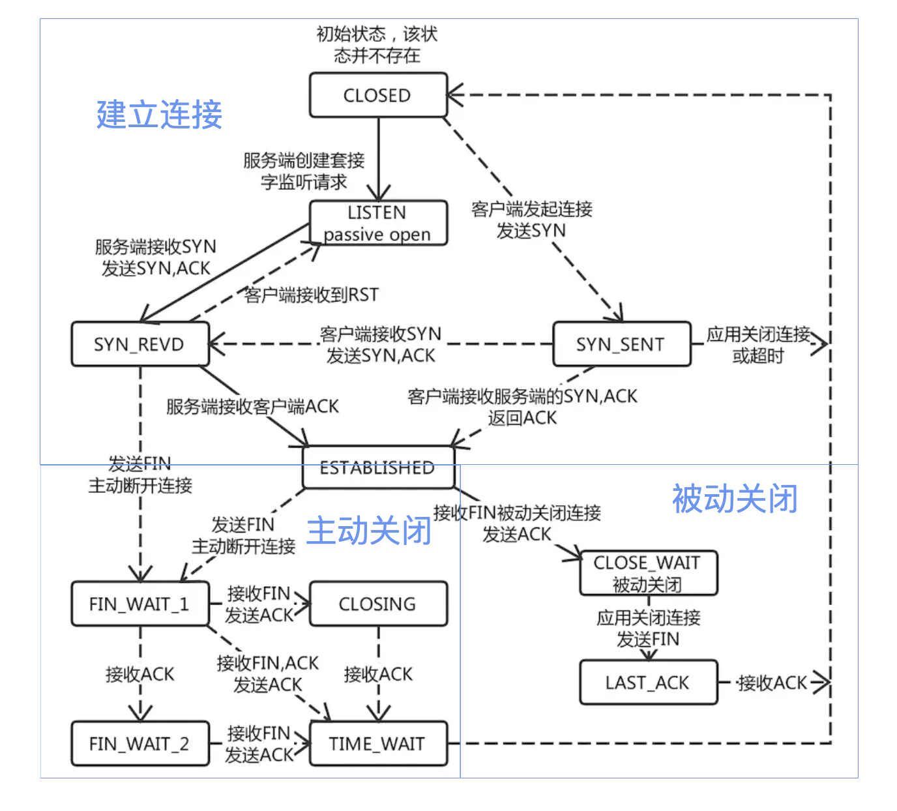
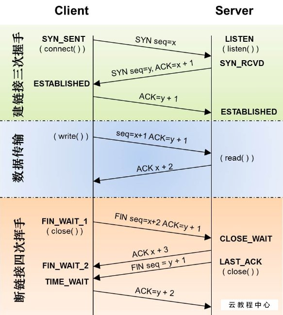

### TCP状态





#### TIME_OUT状态

发起挥手的一方才会经历TIME_WAIT状态

**TIME_WAIT状态的影响**
````
具有TIME_WAIT状态的TCP连接，就好像一种残留的信息一样；
当这种状态存在的时候，服务器程序退出并重新执行会失败，会提示错误：
bind函数返回Address already in use
````

**TIME_WAIT状态的影响时间**
````
连接处于TIME_WAIT状态是有时间限制的（1-4分钟之间） = 2 MSL【最长数据包生命周期】；
````

**TIME_WAIT状态的作用**
````
1.实现可靠的实现TCP全双工的终止；
因为服务器端有TIME_WAIT的存在，服务器会重新发送ACK包给客户端，但是如果没有TIME_WAIT这个状态，那么
无论客户端收到ACK包，服务器都已经关闭连接了，此时客户端重新发送FIN，服务器给回的就不是ACK包，
而是RST【连接复位】包，从而使客户端没有完成正常的4次挥手，不友好，而且有可能造成数据包丢失；
2.允许老的重复的TCP数据包在网络中消逝；
````

